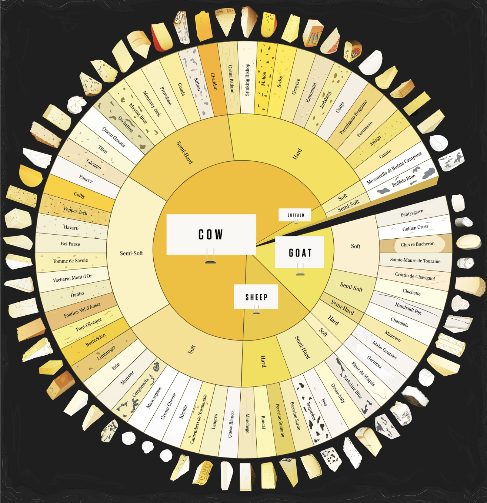

# Data Visualization

## Assignment 2: Good and Bad Data Visualization

### Requirements:

- Data visualizations are important tools for communication and convincing; we need to be able to evaluate the ways that data are presented in visual form to be critical consumers of information 
- To test your evaluation skills, locate two public data visualizations online, one good and one bad  
    - You can find data visualizations at https://public.tableau.com/app/discover or https://datavizproject.com/, or anywhere else you like! 
- For each visualization (good and bad):  
    - Explain (with reference to material covered up to date, along with readings and other scholarly sources, as needed) why you classified that visualization the way you did.

    #### Bad Visualization Example
    For an example of what not to do in data visualization, see the [bad visualization example](badviz.jpg).
      ```
      High Cognitive Load: The sunburst chart is visually complex requiring viewers to process multiple layers and angles simultaneously due to the unconventiional layout, making it harder to compare values accurately.
      Poor Comparability of Data: Data is hard to compare across groups due to the nested nature e.g. comparing the number of visitors across gender and age groups is unintuitive because the segment sizes do not reflect the number of individuals in each group. The collective size of the subgroups based on age do not match the size of the groups based on gender.
      Inefficient Use of space: The central area simply labeled "Visitors" is for the most part wasted space. A simple bar chart or grouped bar chart would provide the same information more compactly and readably.
      Misleading Representation: A small difference in arc length may correspond to significant numerical difference
      Lack of a Clear Takeaway: no key insights are highlighted. Viewers must work hard to decipher the meaning, reducing its effectiveness as a communication tool.
      ```
    - How could this data visualization have been improved?  
      ```
      Use a more appropriate chart type: a grouped bar chart (one bar per age group, separated by gender) woudl improve clarity and comparability or a stacked bar chart could show total visitors with color-coded segments for gender distribution.
      Ensure readability: a horizontal or vertical layout where labels and quantities are aligned would reduce eye strain and improve interpretation
      ```

    #### Good Visualization Example
    Here's an example of an effective visualization: 
    ```
    This is an example of a clear presentation of the heirarchies of various types of cheese. 
    The data is presented in a straightforward manner, easy for viewers to understand these relationships without confusion.
    The type of chart is appropriate and helps rather than hinders the key message.
    Colors are used effectively.
    Areas of the chart are clearly and informatively labeled, easily distiguishable without being too overwhelming.
    It is designed to be accessible to a wide audience including considerations for color blindness and readability.
    ```
    - How could this data visualization have been improved?
    ```
    The chart could be further enhanced with interactive elements possibly displaying nutritional information and statistics related to each type of cheese.
    The font size and text readability could be further improved especially for smaller elements.
    Consider different screen sizes and devices, and ensuring it prints clearly in both color and black-and-white.
    ```

- Word count should not exceed (as a maximum) 500 words for each visualization (i.e. 
300 words for your good example and 500 for your bad example)

### Why am I doing this assignment?:

- This assignment ensures active participation in the course, and assesses the learning outcomes
* Apply general design principles to create accessible and equitable data visualizations
* Use data visualization to tell a story

### Rubric:

| Component               | Scoring   | Requirement                                                 |
|-------------------------|-----------|-------------------------------------------------------------|
| Data viz classification and justification | Complete/Incomplete | - Data viz are clearly classified as good or bad<br />- At least three reasons for each classification are provided<br />- Reasoning is supported by course content or scholarly sources |
| Suggested improvements  | Complete/Incomplete | - At least two suggestions for improvement<br />- Suggestions are supported by course content or scholarly sources |

## Submission Information

🚨 **Please review our [Assignment Submission Guide](https://github.com/UofT-DSI/onboarding/blob/main/onboarding_documents/submissions.md)** 🚨 for detailed instructions on how to format, branch, and submit your work. Following these guidelines is crucial for your submissions to be evaluated correctly.

### Submission Parameters:
* Submission Due Date: `23:59 - 02/03/2025`
* The branch name for your repo should be: `assignment-2`
* What to submit for this assignment:
    * This markdown file (assignment_2.md) should be populated and should be the only change in your pull request.
* What the pull request link should look like for this assignment: `https://github.com/<your_github_username>/visualization/pull/<pr_id>`
    * Open a private window in your browser. Copy and paste the link to your pull request into the address bar. Make sure you can see your pull request properly. This helps the technical facilitator and learning support staff review your submission easily.

Checklist:
- [ ] Create a branch called `assignment-2`.
- [ ] Ensure that the repository is public.
- [ ] Review [the PR description guidelines](https://github.com/UofT-DSI/onboarding/blob/main/onboarding_documents/submissions.md#guidelines-for-pull-request-descriptions) and adhere to them.
- [ ] Verify that the link is accessible in a private browser window.

If you encounter any difficulties or have questions, please don't hesitate to reach out to our team via our Slack. Our Technical Facilitators and Learning Support staff are here to help you navigate any challenges.

